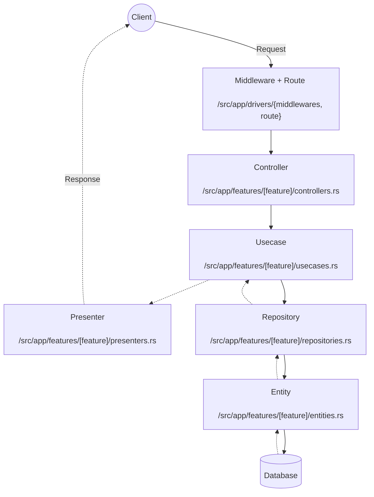

```mermaid
flowchart TD
    Client(("Client"))
    Route["Middleware + Route <br><br>/src/app/drivers/{middlewares, route}"]
    Controller["Controller<br><br>/src/app/features/[feature]/controllers.rs"]
    Presenter["Presenter<br><br>/src/app/features/[feature]/presenters.rs"]
    Usecase["Usecase<br><br>/src/app/features/[feature]/usecases.rs"]
    Repository["Repository<br><br>/src/app/features/[feature]/repositories.rs"]
    Entity["Entity<br><br>/src/app/features/[feature]/entities.rs"]
    DB[(Database)]

    %% Top to Bottom
    Client --Request--> Route
    Route --> Controller
    Controller --> Usecase
    Usecase --> Repository
    Repository --> Entity
    Entity --> DB

    %% Bottom to Top
    DB -.-> Entity
    Entity -.-> Repository
    Repository -.-> Usecase
    Usecase -.-> Presenter
    Presenter -.Response.-> Client
```
